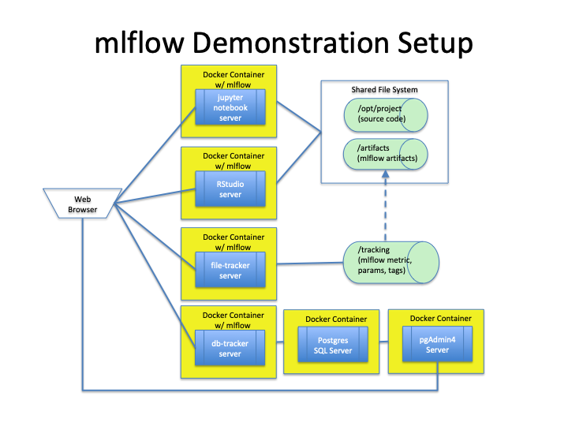
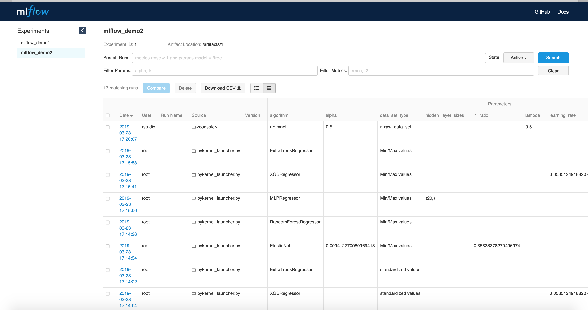
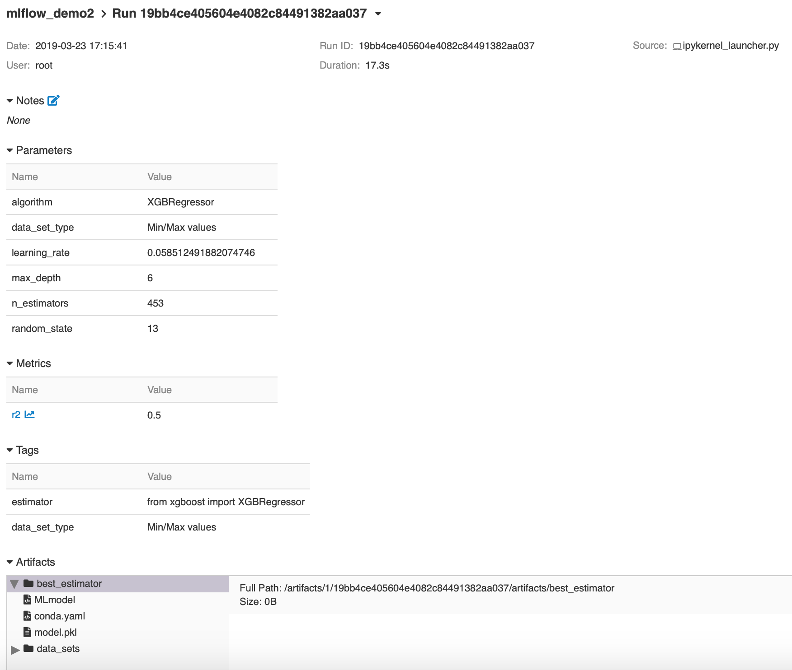

# mlflow Demonstration

**IMPORTANT**: The `master` branch represents work-in-progress.  Stable functionality are designated by 
tags, e.g., v0.1.0, v0.2.0, etc, identified in 
[_Releases_ section](https://github.com/jimthompson5802/mlflow_demo/releases).

This repo demonstrates the use of the open source project [mlflow](https://mlflow.org), which is used to record 
and manage results of machine learning experiments.  Docker containers
provide the run-time environment for this demonstration.

Code used in this demonstration is based on these mflow examples: 
[`examples/sklearn_elasticnet_wine`](https://github.com/mlflow/mlflow/tree/master/examples/sklearn_elasticnet_wine) 
and [`examples/r_wine`](https://github.com/mlflow/mlflow/tree/master/examples/r_wine)

## Demonstration Environment



## System Requirements
* [Docker](https://docs.docker.com/develop/)
* [Docker Compose](https://docs.docker.com/compose/overview/)

Work performed with Docker for Mac Version 2.0.0.3 (31259)


## Environment Setup

### Set up local storage
* Clone repo to local computer.  Note directory for the local repo, e.g., `/home/userid/mlflow_demo`
* Create directory to hold mlflow server tracking data and artifacts, e.g., `/home/userid/mlflow_server`.  Within this  
directory create these subdirectories
```
/home/userid/mlflow_server/tracking
/home/userid/mlflow_server/artifacts
/home/userid/mlflow_server/postgres/postgres/data
/home/userid/mlflow_server/postgres/postgres/admin
```

### Setup required environment variables
* Change working directory to `run_demo`
* Update contents of `./setup_environment_variables` to specify values for the required environment variables.
```
MLFLOW_VERSION
MLFLOW_VERSION_TO_INSTALL
MFLOW_DEMO_DIRECTORY
MLFLOW_TRACKING_DIRECTORY
MLFLOW_TRACKER_URL
```
 
Specify version of mlflow package.  See example below.
```
###
# Set up environment variables to control building and
# running demonstration mlflow Docker containers
###

# mlflow version to install
export MLFLOW_VERSION=0.9.0

# directory containing demonstration source code
export MLFLOW_DEMO_DIRECTORY=/path/to/directory/for/local/repo

# directory to hold mlflow tracking and artifacts
export MLFLOW_TRACKING_DIRECTORY=/path/to/directory/for/tracking-artifacts

# mflow tracking server URL: file_tracker or db_tracker
# use MLFLOW_TRACKER_URL=http://file_tracker:5000 for file-based tracker server
# use MLFLOW_TRACKER_URL=http://db_tracker:5001 for Postgres SQL database tracker server
export MLFLOW_TRACKER_URL=http://db_tracker:5001

###
# EXAMPLES
# MLFLOW_VERSION_TO_INSTALL="mlflow"    Current version in PyPi
# MLFLOW_VERSION_TO_INSTALL="mlflow==${MLFLOW_VERSION}"   Specific version from PyPi
# MLFLOW_VERSION_TO_INSTALL="git+https://github.com/mlflow/mlflow.git@vx.y.z#egg=mlflow"  specific version from github
###
# uncomment following to install mlflow from pypi
#export MLFLOW_VERSION_TO_INSTALL="mlflow==${MLFLOW_VERSION}"

# uncomment following to install mlflow from github
export MLFLOW_VERSION_TO_INSTALL="git+https://github.com/mlflow/mlflow.git@v${MLFLOW_VERSION}#egg=mlflow"  specific version from github

```

### Build the required mlflow Docker images
* After updating `setup_environment_variables`, execute following command to set  
environment variables: `. ./setup_environment_variables`

* Run the following command to initially build the required Docker images.
```
bash ./build_images
```
Note:  On a MacbookPro with 16GB RAM, it takes 10 to 13 minutes for the initial 
build of the images.

### Postgres SQL database tracker components

* To disable the database tracker components, open `docker-compose.yml` file and find 
this string `# TO DISABLE DATABASE TRACKER COMPONENTS REMOVE` and follow instructions.  
Skip the next step.

* To make use of the database tracker components, run the following command to pull 
PostgresSQL database related images from dockerhub.com
```
bash ./pull_images
```
Note:  This will take about one to two minutes to pull down the PostgresSQL images.


## Start demonstration containers
After building the Docker images, navigate to `./run_demo`.   Ensure the required
environment variables are defined by running `. ./setup_environment_variables`.

* To start the Docker containers for the demonstration environment:
```
docker-compose up --detach
```
* To stop the Docker containers:
```
docker-compose down
```

## Connecting to containers
Open a browser and enter the following URL for the respective service.
* Jupyter Notebook Python Container:  `http://0.0.0.0:8888`
* RStudio Container: `http://0.0.0.0:8787`
* mlflow file-based tracking server: `http://0.0.0.0:5000`
* mfllow PostgresSQL-based tracking server: `http://0.0.0.0:5001`
* Postgres SQL pgAdmin Server: `http://0.0.0.0:80`, login id: `mlflow@gmail.com`, password `pgadmin4`

## Demonstration Programs
* **mlflow_demo1.ipynb**: Jupyter notebook runs a single machine learning experiment.
* **mlflow_demo2.ipynb**: Jupyter notebook performs hyper-parameter optimization.
* **mlflow_demo2_r.Rmd**:  Rmarkdown notebook runs a single machine learning experiment.
* **mlflow_api_demo.ipynb**: Jupyter notebook creates pandas dataframe from mlflow experiment results.
* **mlflow_reproducibility.ipynb**: Jupyter notebook that creates results from an earlier experiment. 


## mlflow Demonstration Dashboard

### Experiment Summary


### Run Summary
