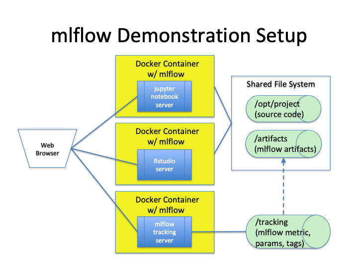

# mlflow Demonstrations

This repo demonstrates the use of [mlflow](https://github.com/mlflow/mlflow).  Docker containers
provide the run-time environment for this demonstration.

## Demonstration Environment



## System Requirements
* Docker
* Docker Compose

Work performed with Docker for Mac Version 2.0.0.3 (31259)


## Initial Setup
* Clone repo to local computer.  Note directory for the local repo, e.g., `/home/user/mlflow_demo`
* Create directory to hold mlflow server tracking data and artifacts, e.g., `/home/userid/mlflow_server`.  Within this  
directory create two subdirectories called `tracking` and `artifacts`
* Navigate to `./run_demo`
* Update contents of `setup_environment_variables` to specify values for required directories.  If required specify 
version of mlflow package.  See example below.
```
# version of mlflow to install in containers
export MLFLOW_VERSION=0.8.2

# directory containing demonstration source code
export MLFLOW_DEMO_DIRECTORY=/home/user/mlflow_demo

# directory to hold mlflow tracking and artifacts
export MLFLOW_TRACKING_DIRECTORY=/home/userid/mlflow_server

```
* After updating `setup_environment_variables`, execute following command to set  
environment variables: `. ./setup_environment_variables`

* Run the following commands.  These commands are required 
to initially build or rebuild the required Docker images.
```
(cd python_image && bash build_image)
(cd mlflow_r_image && bash build_image)
(cd mlflow_server && bash build_image)
```
Note:  On a MacbookPro with 16GB RAM, it took about 14 minutes for the initial 
build of the three images.


## Start demonstration containers
Navigate to ./run_demo
* To bring up the three containers:
```
docker-compose up --detach
```
* To stop the three containers:
```
docker-compose down
```

## Connecting to containers
* Python Container:  `http://0.0.0.0:8888`
* R Container: `http://0.0.0.0:8787`
* mlflow tracking server: `http://0.0.0.0:5000`